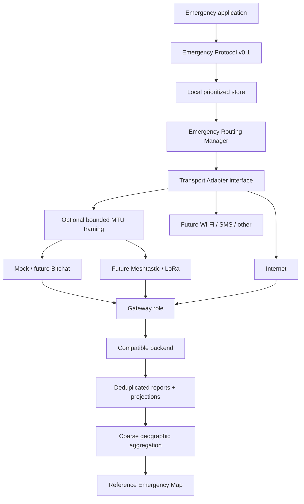

# Architecture

## Principles

1. Protocol semantics do not import or mention concrete transports.
2. Routing selects adapters using declared capabilities; an adapter delegates internal discovery, hops, cryptography, and routing to its transport.
3. Reports are immutable and signed. Delivery envelopes are mutable at each hop.
4. Delivery is at-least-once. Receivers must be idempotent by `eventId`.
5. Public products consume coarse aggregates by default.

## Components

## Important boundaries

`EmergencyReport` contains human meaning and is covered by its signature. `EmergencyEnvelope` contains packet lifetime and forwarding metadata. A forwarding node may increment `hopCount`, lower `expiresAt`, and append transport history, but cannot change the signed report unnoticed.

`validUntil` is signed. The mutable envelope's `expiresAt` may shorten that lifetime but must never exceed it. Hop TTL (`hopLimit`) and time expiration are separate.

Small-MTU adapters fragment only the serialized envelope and reassemble it before normal validation and queue admission. Partial frames never become semantic reports or peer custody.

The gateway is a role, not a mandatory central service. Any compatible implementation may accept the same binary packet and synchronize it with one or more backends.

## Routing v0.1

The deterministic strategy filters unavailable adapters, scores egress, latency, energy, and estimated cost, then chooses one route for ordinary reports. A CRITICAL report or SOS may use at most two adapters when not in low-battery mode. It never selects internal mesh hops.

The strategy is intentionally replaceable. Congestion, learned delivery probability, and confirmed egress gradients are future inputs, not part of this iteration.

## Delivery semantics

- At-least-once acceptance with duplicates expected.
- `eventId` remains stable across every path and is the idempotency key.
- A peer ACK means only that another node accepted custody.
- A backend ACK means only that a compatible backend stored or recognized the report.
- Neither ACK means that a human saw the report or that help is coming.

## Production seams

The in-memory queue and backend support fast simulation. Durable SQLite implementations are included for local operation; PostgreSQL/PostGIS remains the multi-gateway target without changing protocol, routing, gateway, or transport contracts.
