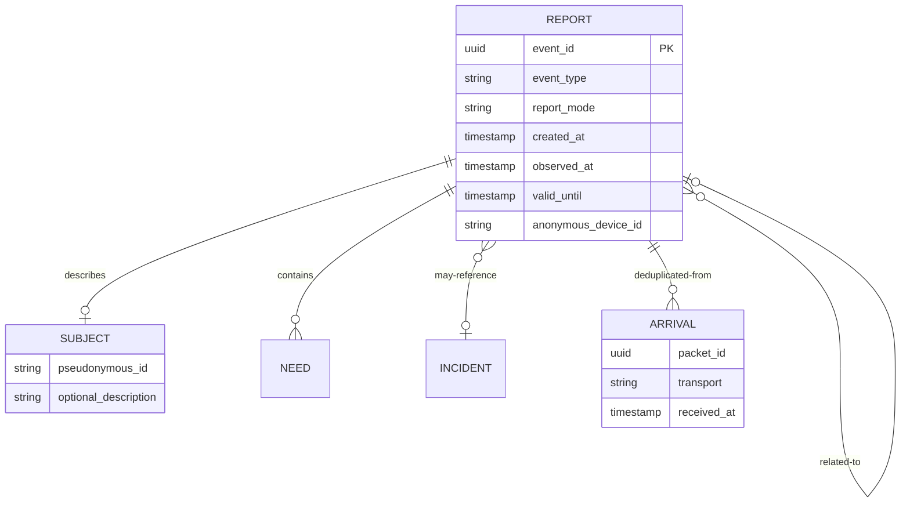

# Data and privacy model

The reference backend stores immutable reports and derives replaceable projections. It never rewrites an observation to manufacture a current fact.

## Identity and person observations

`subject.pseudonymousId` is an application-provided correlation hint, not a verified identity. A subject need not use the application. Names, descriptions, age ranges, or distinguishing features are optional and sensitive.

A `PERSON_LAST_SEEN` report records one historical observation. A `PERSON_FOUND` report references the observation through `relatedEventId` (or a subject hint when no report id is known). The active-search view is a projection: prior observations remain immutable and auditable after resolution.

## Public, protected, and identity data

- Public: event class, coarse zone, aggregate counts, need categories, report age.
- Protected: precise location, detailed personal description, contact data, and instance-defined content encrypted with the versioned protected-payload container for authenticated deployment recipients.
- Identity metadata: authorization or organizational attributes interpreted only by a deploying instance.

The reference map rounds coordinates to a coarse cell and returns counts. This is a demonstration, not a sufficient production privacy mechanism: the reference now provides low-count suppression, configurable spatial resolution and time buckets; access control, audit logging, and differencing-attack defenses remain required.

## Suggested production tables

Use append-only `reports`, separate `arrivals`, optional `subjects`, explicit `report_relations`, and materialized or computed `area_aggregates`. The SQLite reference stores canonical signed bytes so verification does not depend on a later serializer; other backends should preserve the same property. PostgreSQL/PostGIS is the intended reference persistence target after the vertical slice.
